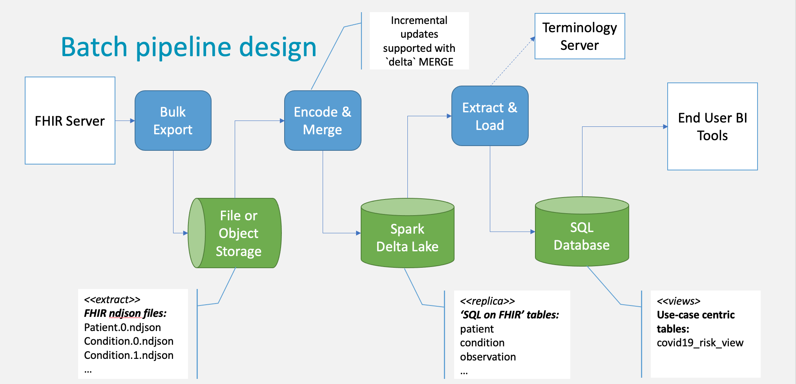
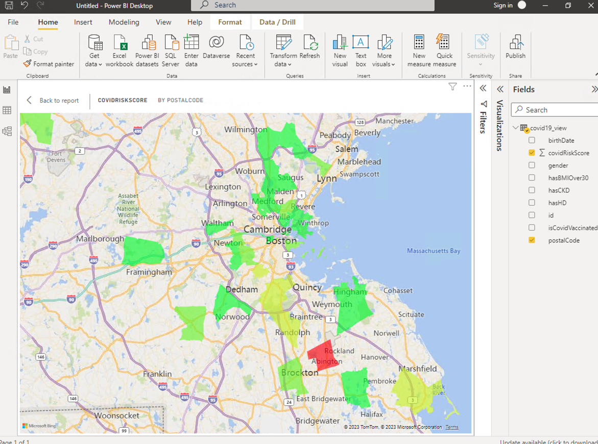

# FHIR Analytics Pipeline
An example of how to build a pipeline for extracting, transforming and analyzing FHIR data.

### Use case

The pipeline addresses the use case of self-service analytics for COVID-19 management.

In particular, we want the data analyst with some knowledge of SQL 
and armed with BI tools such a Power BI to be able to leverage FHIR data and answer questions like: 
"How many non-vaccinated patients are there in various areas, stratified by a customisable risk score?"

In order to enable this use case, we will build a pipeline that extracts a simple, 
tabular use-case centric view of the data from a FHIR server to an SQL database.

The use-case centric view includes the following columns:
- `id`: patient's id
- `gender`: patient's gender
- `birthDate`: patients' date of birth
- `postalCode`: patient's address postal code
- `hasHD`: has the patient been ever diagnosed with a heart disease
- `hasCKD`: has the patient been ever diagnosed with a chronic kidney disease
- `hasBMIOver30`: has the patient ever had BMI over 30
- `isCovidVaccinated`: has the patient been vaccianed with any of the COVID-19 vaccines

### Design and implementation

The design of the pipeline is shown of the figure below.



The pipeline consists of the following steps:
- Extracting the ndjson data from the FHIR server using [FHIR Bulk Export API](https://build.fhir.org/ig/HL7/bulk-data/export.html)
- Encoding ndjson resource data as Apache Spark data frames and storing them as tables in a Delta Lake
- Transforming the data using FHIRPath into the use-case centric view and loading it into an SQL database

The pipeline is implemented using Databricks notebooks and in addition to Apache Spark heavily 
relies on [Pathling](https://pathling.csiro.au/) python libraries. 

In particular leverages Pathling to encode FHIR resources as Spark data frames, 
and to transform the FHIR data to the use-case centric view with FHIRPath expressions and the `extract()` operation. 
The following snipped of the code shows how the transformation is performed for the COIVD-19 use case:

```python
coivd19_view_df = fhir_ds.extract('Patient',
    columns= [
        exp("id"),
        exp("gender"),
        exp("birthDate"),
        exp("address.postalCode.first()").alias("postalCode"),
        exp("reverseResolve(Condition.subject).exists(code.subsumedBy(http://snomed.info/sct|56265001))").alias("hasHD"),
        exp("reverseResolve(Condition.subject).exists(code.subsumedBy(http://snomed.info/sct|709044004))").alias("hasCKD"),
        exp("reverseResolve(Observation.subject).where(code.subsumedBy(http://loinc.org|39156-5)).exists(valueQuantity > 30 'kg/m2')").alias("hasBMIOver30"),
        exp("reverseResolve(Immunization.patient).vaccineCode.memberOf('https://aehrc.csiro.au/fhir/ValueSet/covid-19-vaccines').anyTrue()").alias("isCovidVaccinated"),
    ],
    filters = [
        "address.country.first() = 'US'"
    ]
)
```

### The project

The project has the following structure:

- `etl` directory contains Databricks notebooks with the implementation of the pipeline.
- `demos` directory contains Databricks notebooks that explore various aspects of working with the FHIR data, such us:
  - transforming with FHIRPath and (Spark) SQL
  - incorporating terminology queries
  - working with extensions
  - working with recursive structures such as `QuestionnaireResponse` and `Questionnaire`
- `ctrl` directory contains notebooks that can be used to setup/cleanup the environment.
- `analytics` directory contains notebooks that provide examples of performing simple analytics.


### Analytics

Please watch [the screencast](https://aehrc.github.io/fhir-analytics-pipeline/assets/PowerBI_CovidRiskScore.mov)
to see how PowerBI can be used to connect to the COVID-19 view at Databricks DeltaLake SQL database, 
to perform some simple analytics, and produce the COVID-19 risk map below:



### References:
- [FHIR Bulk Export API](https://build.fhir.org/ig/HL7/bulk-data/export.html)
- [Pathling Documentation](https://pathling.csiro.au/)
- [Pathling Github](https://github.com/aehrc/pathling)
- [Pathling: analytics on FHIR, John Grimes, et al., DOI:10.1186/s13326-022-00277-1 ](https://jbiomedsem.biomedcentral.com/articles/10.1186/s13326-022-00277-1)


